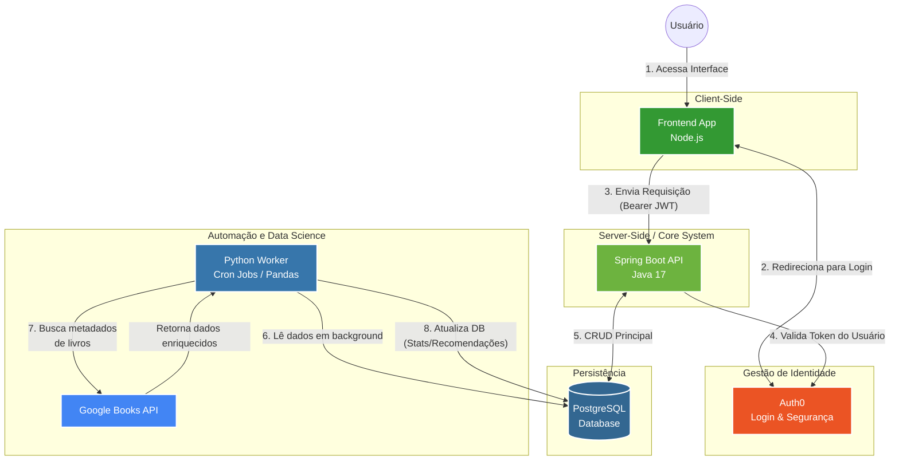
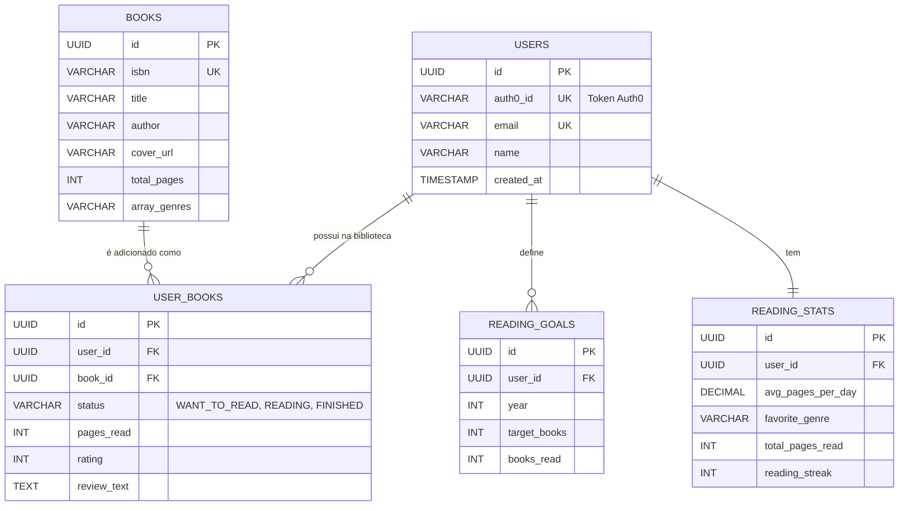

# Biblioteca Pessoal (Personal Library System)


## Visão Geral do Projeto

Este repositório contém um sistema avançado de gerenciamento de acervo literário e acompanhamento de leitura. O projeto adota uma arquitetura multi-linguagem orientada a serviços, integrando **Node.js** (Frontend), **Java com Spring Boot** (Core System) e **Python** (Data & Automation Worker), com a segurança e gestão de identidade gerenciadas pelo **Auth0**.

O sistema vai além do gerenciamento básico, oferecendo importação automática de metadados, análise de estatísticas de leitura e um sistema inteligente de recomendações personalizadas.

---

## Arquitetura e Fluxo de Dados
A solução foi desenhada para escalabilidade e separação de responsabilidades. O diagrama abaixo ilustra como os diferentes ecossistemas se comunicam:



---

## Modelagem do Banco de Dados (ERD)

A base de dados relacional foi normalizada para evitar redundâncias e facilitar a integração com o worker em Python.



---

## Funcionalidades da API (Endpoints Principais)

A API RESTful construída em **Spring Boot** expõe os seguintes endpoints consumidos pelo frontend. *Todas as rotas requerem o envio do token JWT do Auth0 no Header (`Authorization: Bearer <token>`).*

### 📚 Livros e Acervo Pessoal (`/api/books`)
* `GET /api/books/my-library` - Retorna todos os livros do usuário autenticado.
* `POST /api/books` - Adiciona um novo livro à biblioteca pessoal.
* `PUT /api/books/{id}/progress` - Atualiza a página atual ou o status de leitura (ex: mudou de *Lendo* para *Lido*).
* `DELETE /api/books/{id}` - Remove o livro da estante do usuário.

### 📊 Estatísticas e Metas (`/api/stats`)
* `GET /api/stats` - Retorna as estatísticas consolidadas do usuário (processadas previamente pelo Python).
* `POST /api/stats/goals` - Define uma nova meta de leitura para o ano vigente.
* `GET /api/stats/recommendations` - Retorna uma lista de livros sugeridos pelo algoritmo de similaridade.

---

## Estrutura do Repositório

```text
/
├── backend-java/       # API Principal (Spring Boot)
│   ├── src/
│   └── build.gradle
├── client/             # Frontend App (Node.js)
│   ├── src/
│   └── package.json
├── worker-python/      # Automações e Recomendações (Python)
│   ├── main.py
│   └── requirements.txt
└── README.md
```

---

## Pré-requisitos de Instalação

* **Java JDK 17+**
* **Node.js 18+**
* **Python 3.9+** (com `pip`)
* **PostgreSQL 14+**
* **Conta no Auth0** (Para configuração das chaves de ambiente)

---

## Instruções de Execução Local

### 1. Banco de Dados e Variáveis de Ambiente
Crie um banco de dados no PostgreSQL chamado `biblioteca`. Configure as credenciais do banco e os domínios do Auth0 no arquivo `application.properties` (Java) e no `.env` (Node).

### 2. Core System (Java)
Em um terminal, inicie a API principal:
```bash
cd backend-java
./gradlew bootRun
```

### 3. Worker de Automação (Python)
Em um segundo terminal, inicie o serviço de background:
```bash
cd worker-python
pip install -r requirements.txt
python main.py
```

### 4. Execução do Frontend

**4.1. Navegar para o diretório do cliente**
Vá para o diretório do frontend:
```bash
cd client
```

**4.2. Instalar as dependências**
Instale as dependências do projeto de forma limpa:
```bash
npm ci
```

**4.3. Rodar o Frontend**
Execute o servidor de desenvolvimento:
```bash
npm run dev 
```
*A interface estará acessível na porta configurada (ex: `http://localhost:3000`).*

